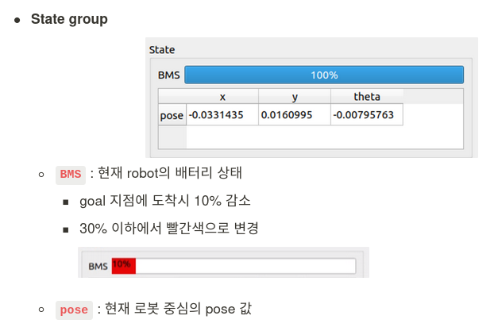
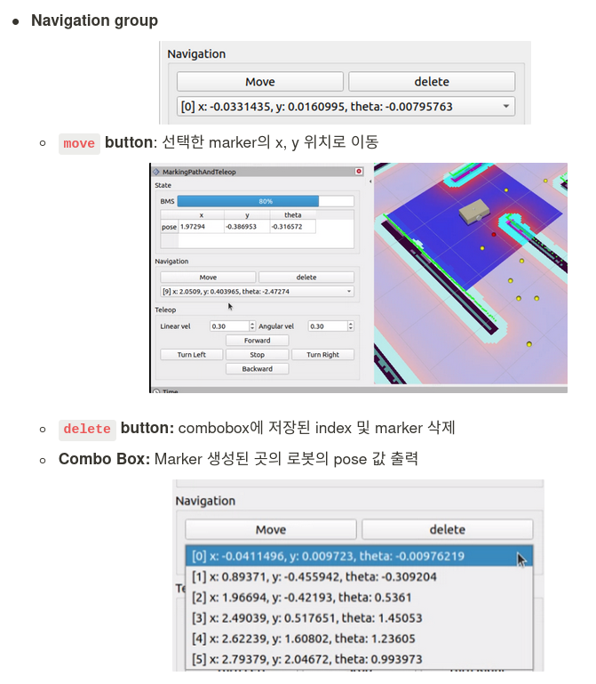
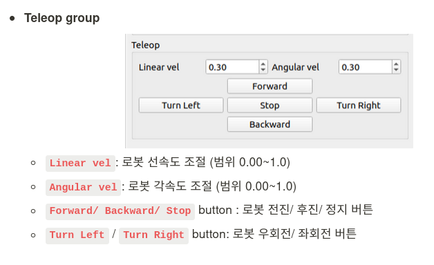

## rviz_plugin branch

**`show_robot_moving_path`** [[Mission 5]: GUI 조작기](https://www.notion.so/sysconresearch/Mission-5-Gui-cb5d520a94c840d1bc20788b3f596a95?pvs=4)
   - **Concept**: Panel type Rviz plugin that performs teleop function and displays the robot's driving path as sphere shape
   - **Marking Path And Teleop**
        

            
            
        

   - **Detail Description**
        

            
            
            
        

 

**`Others`** : suspension(not in progress)