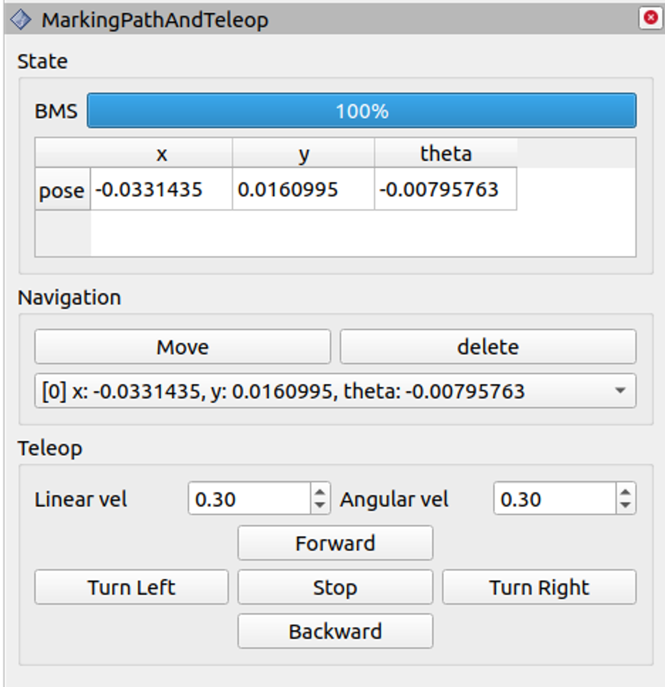
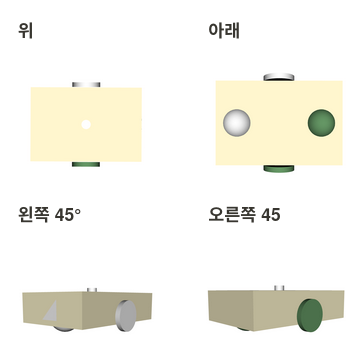
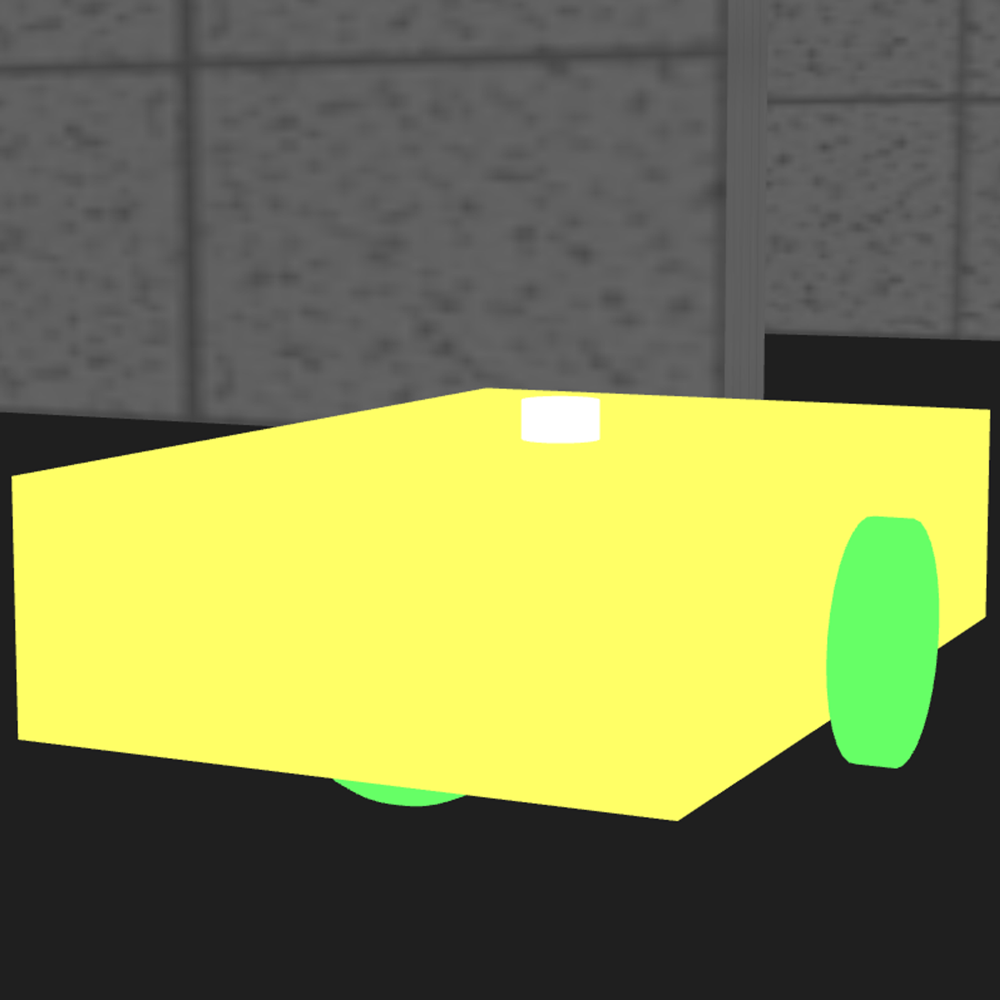
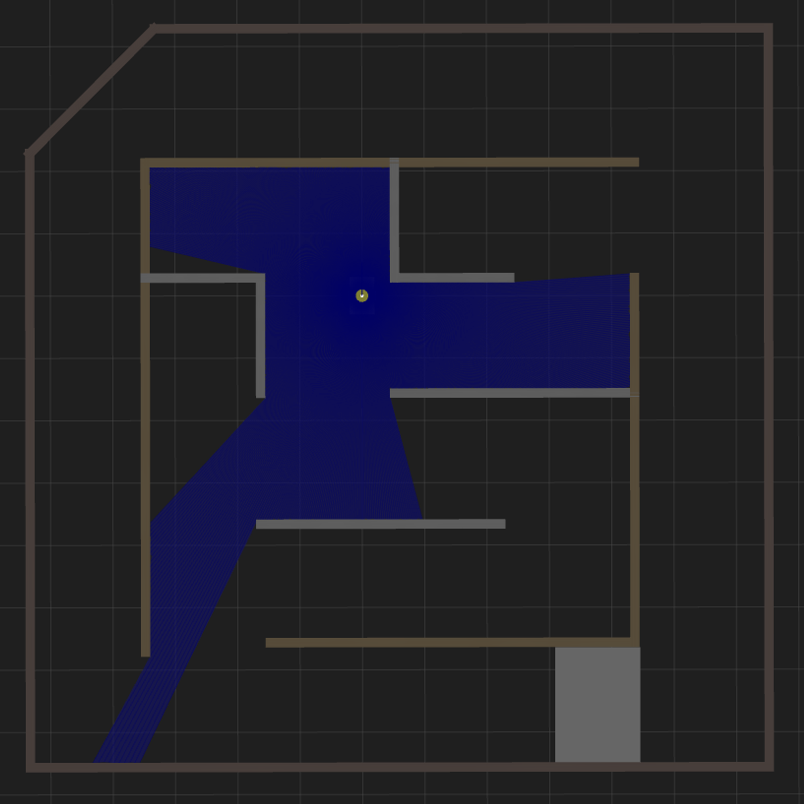
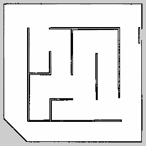
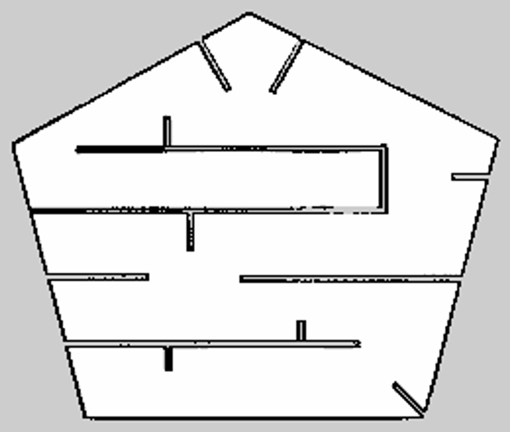
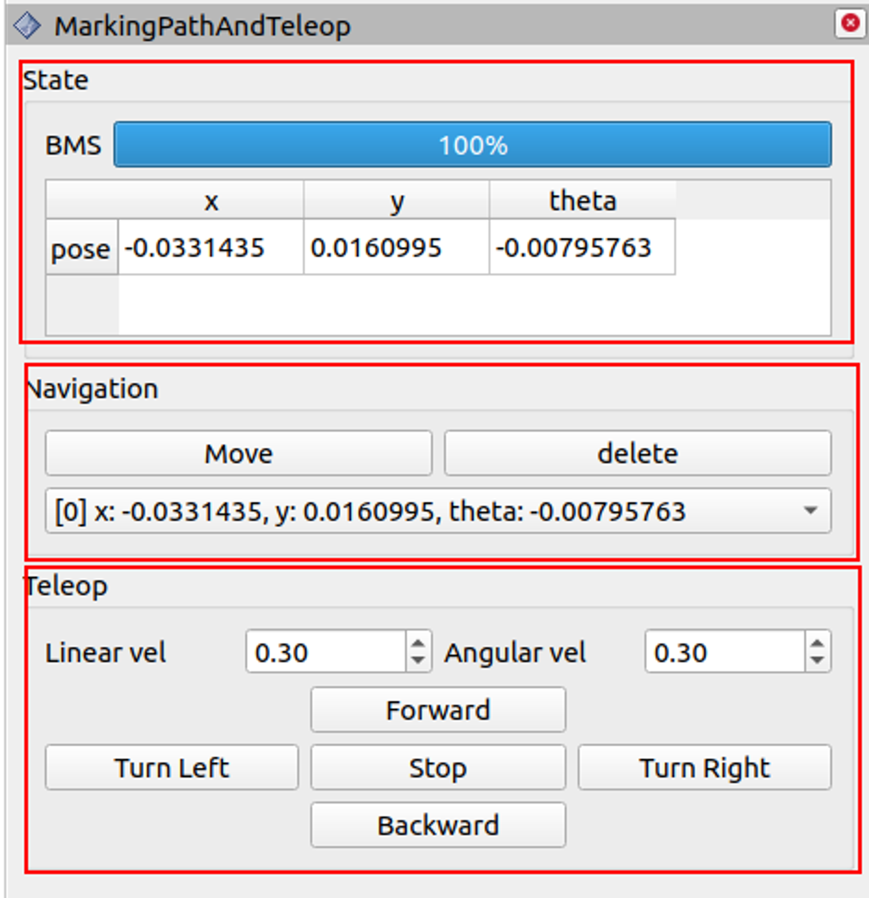

<<<<<<< HEAD
## Minseo Jeong git repository

### Description of Branches

- **`main`**
- **`assign`** ← **done**
  - Topic: 1st and 2nd assignment of system part
  - Duration: 2023.7.14(Fri) ~ 7.21(Fri)
  - Concept: make pub-sub(1st) and service with trigger(2nd) 

- **`biibiii_simulation`**
  - Topic: compose simulation robot project of system part
  - Duration: 2023.8.11(Fri) ~ 10.20(Fri) 
    [cf.] 2023.7.25(Tue)~ 8.10(Thur) is the duration that experience the turtlebot3 simulation
  - Concept: make own gazebo world like mini cloosed loop maze and two wheeled
    robot with two casters that positioned front and backward respectively. And the branch also include other things such as different maps, jms_simulation_robot etc. 

- **`ros_tutorials`**
   - Topic: a buldle of cpp and python packages that I studied. It is for records. 

- **`rviz_plugin`**
   - Topic: rviz plugins that I'm developing. 
     [cf.] there is no complete plugin package that not include some bugs.

| Name            | Image |
|-----------------|-------|
|**show_robot_moving_path** It is a Rviz panel Gui made as a kind of system part final project during 2023.9.15 ~ 2023.10.20| |
|**others** suspension| |

 

#### Update Date: 2023.10.31
=======
## Biibiii_simulation branch

### Final assignment of System part 
    - Topic: Final project of system part with manager HaeJin Kim
    - Total duration: 2023.7.24(Mon) ~ 10.20(Fri)
    - Environment: ROS1(noetic), Ubuntu 20.04
    - Language: C++
    - Road Map
      1. Turtlebot3 Simulation
      2. Robot model 구성(URDF & xacro)
      3. teleop & sim world
      4. SLAM(Mapping + Navigation)
      5. Mission Command
   - **Link**
   - Notion [시뮬레이션 로봇](https://www.notion.so/sysconresearch/7fc4a65881794b37a0d292a61730601c?pvs=4)
   - Git
      - personal: [MYSR-Minseo Jeong Making_Your_Simulation_Robot](https://github.com/Syscon-Lab/making_your_simulation_robot.git) 
      - plugin in Khj world ver.: [develop](https://github.com/Syscon-Lab/making_your_simulation_robot.git)
 

**`1. Turtlebot3 Simulation`** [Turtlebot3 simulation](https://www.notion.so/sysconresearch/Assign3_Robot-simulation-e0c62e254a2e4a6c885b16e239e11809?pvs=4)
   - **Duration** : 2023.07.25(Tue) ~ 08.10(Thur); 12days
   - **Concept** : Experience Gazebo, SLAM, Navigation in Turtlebot3 Simulation. 
                   Understand how to compose package and ros node in each mode of simulation
                   Understand meaning and definition of costmap element
   - **Guide ref.** : [Turtlebot3 Simulation](https://www.notion.so/sysconresearch/1-Turtlebot3-Simulation-3a285c942cf04044aa7b8403d6742802?pvs=4)
 

**`2. Robot model 구성(URDF & xacro)`**
   - **Duration** : 2023.08.11(Fri)~08.17(Thur); 4days
   - **Concept** : Make two drive wheeled mobile robot with one LiDAR and load on Rviz&Gazebo
   - **Guide ref.** : [Robot model 구성(URDF & xacro)](https://www.notion.so/sysconresearch/2-Robot-model-URDF-xacro-1ba0466ff7e641fc87c1683a30ad597e?pvs=4)
   

      
      
   

 

**`3. teleop & sim world`**
   - **Duration** : 2023.08.18(Fri) ~ 08.31(Thur); 10days
   - **Concept** : Compose virtual environment on Gazebo and moving robot by teleop
   - **Guide ref.** : [teleop & sim world](https://www.notion.so/sysconresearch/3-teleop-sim-world-478a78464d0143e386a7677b94a65f45?pvs=4)
   
  

 

**`4. SLAM(Mapping + Navigation)`**
   - **Duration** : 2023.09.01(Fri) ~ 09.14(Thur); 10days
   - **Concept** : Understand SLAM algorithm by applying algorithm in world made by oneself
   - **Guide ref.** : [SLAM(Mapping + Navigation)](https://www.notion.so/sysconresearch/4-SLAM-Mapping-Navigation-605ea983137e410c82320961afe61196?pvs=4)
   

      
      
   

 

**`5. Mission Command : GUI 조작기 제작`** [[Mission 5]: GUI 조작기](https://www.notion.so/sysconresearch/Mission-5-Gui-cb5d520a94c840d1bc20788b3f596a95?pvs=4)
   - **Prerequisite**
      - Duration : 2023.09.15(Fri) ~ 10.20(Fri); 21days
      - Concept : Select one topic in mission list and make one package.
      - Guide ref. : [개인 별 Mission](https://www.notion.so/sysconresearch/5-Mission-9aa18ef95f3944378efca67093f05201?pvs=4)
   - **Total Duration**: 2023.09.05(Tue) ~ 10.20(Fri)
   - **Concept**: Panel type Rviz plugin that performs teleop function and displays the robot's driving path as sphere shape
   

      
      
   

 

**`Others`**
   - **etc**: maps, some files etc..
   - **jms_simulation_robot**: Initial pkg of this project
   - **cf.** Notion: [[9월 세미나]시뮬레이션 로봇 구성](https://www.notion.so/sysconresearch/9-9ff409ca82804537bc1df02048e6c800?pvs=4)
>>>>>>> release-0.1.0
